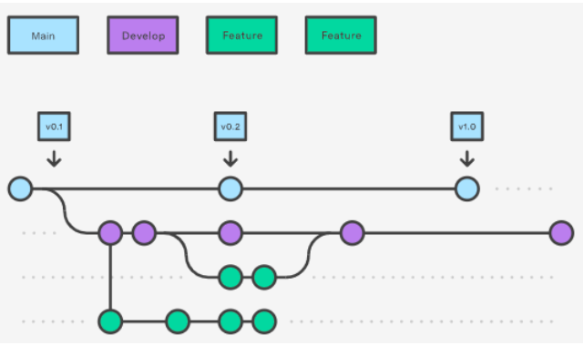
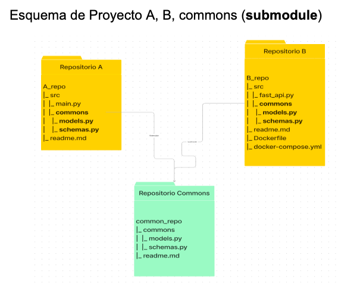
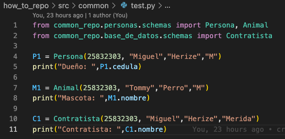

# Protocolo para compartir codigo - POC

En este documento se explicara un paso a paso de cómo se conectan repositorios git en distintos sitios y con diferentes dueños para trabajar en conjunto con uso del workflow de trabajo de git.

## Estructura de directorios de Repositorios

```bash
common_repo
|_ commons
|  |_ models.py
|  |_ schemas.py
|_ readme.md

A_repo
|_ src
|  |_ main.py
|  |_ commons (from common_repo)
|_ readme.md

B_repo
|_ src
|  |_ fast_api.py
|  |_ commons (from common_repo)
|_ readme.md
|_ Dockerfile
|_ docker-compose.yml

how_to_repo
|_ readme.md

```

Para la demostración de estos repositorios que siguen aproximadamente la estructura descrita arriba, se ha creado los siguientes repositorios:

[Common_repo](https://github.com/migherize/common_repo)

[A_repo](https://github.com/migherize/A_repo)

[B_repo](https://github.com/migherize/B_repo)

[How_to_repo](https://github.com/migherize/how_to_repo)

Además, el sistema de carpeta lo encontraras en este link: [Google Drive](https://drive.google.com/drive/folders/14WCMBR09TxO898S3gDD_Y7x_g2xEji_i?usp=sharing)

En los repositorios anteriores existe un repositorio con código que puede ser reutilizado por otros proyectos (repositorio common_repo), por consiguiente logra que otros proyectos puedan usar el código en común.

* Cada uno de los repositorios cumple con las características del flujo de trabajo siguiente:



Dónde,

1. Main: Es la rama principal del repositorio y almacena el historial oficial de versiones.
2. Develop: Es la rama que sirve como una sucursal de integración para funciones
3. Feature: Son ramas de características bifurcadas de la rama develop para funciones, solicitudes de incorporación de cambios, experimentos aislados para una colaboración más eficiente, entre otros.

### Material de apoyo para flujo de trabajo y comando git submodule:

Flujo de trabajo: 
[Github Flow](https://www.youtube.com/watch?v=2Xagp86uOuI&ab_channel=CodelyTV-Redescubrelaprogramaci%C3%B3n)

Submodule en Git:

[Submodule en Git parte 1](https://www.youtube.com/watch?v=YVUkxt3Bvwg&ab_channel=makigas%3Atutorialesdeprogramaci%C3%B3nç)

[Submodule en Git parte 2](https://www.youtube.com/watch?v=lBTykudEa_g&ab_channel=makigas%3Atutorialesdeprogramaci%C3%B3n)


# Situaciones Posibles
##### Situaciones posibles para usos en repositorios con submódulos y compartidos:

### Usuario A trabaja en el proyecto A
* Usuario A para trabajar en el proyecto A debe cumplir los siguientes pasos:
```python
# Fase 1: Entrada 
    $ git clone https://github.com/migherize/A_repo.git
    $ cd A_repo
    $ git checkout develop
    $ cd src/common_repo
    $ git submodule init
    $ git submodule
    # O en caso de ser muchos submódulos
    $ git submodule update –remote –recursive
    $ cd ..
    $ git branch <Feature_usuario_A> #nombre de tu rama de modificación. Ejemplo: (fix-user)
    $ git checkout Feature_usuario_A

# Fase 2: Proceso 
    “Hacer modificaciones en el código”.
    $ git add .
    $ git commit -m "comentarios del commit"
    $ git push origin Feature_usuario_A

# Fase 3: Salida 
    $ git checkout develop
    $ git merge Feature_usuario_A

```
### Usuario B trabaja en el proyecto B
* Usuario B para trabajar en el proyecto B debe cumplir los siguientes pasos:
```python
# Fase 1: Entrada 
    $ git clone  https://github.com/migherize/B_repo.git
    $ cd B_repo
    $ git checkout develop
    $ cd src/common_repo
    $ git submodule init
    $ git submodule
    # O en caso de ser muchos submódulos
    $ git submodule update –remote –recursive
    $ cd ..
    $ git branch <Feature_usuario_B> #nombre de tu rama de modificación. Ejemplo: (fix-user)
    $ git checkout Feature_usuario_B

# Fase 2: Proceso 
    “Hacer modificaciones en el código”.
    $ git add .
    $ git commit -m "comentarios del commit"
    $ git push origin Feature_usuario_B

# Fase 3: Salida 
    $ git checkout develop
    $ git merge Feature_usuario_B

```

### Usuarios A, B y C trabajan en el proyecto commons.
* Para cualquier usuario (A,B,C) trabajar en el proyecto commons es posible, pero para ello debe cumplir con las siguientes reglas:

1. El proyecto commons es un repositorio que funciona como submódulo de otros, es decir que otros repositorios lo están utilizando.
2. Para que las funciones, módulos, schemas, entre otros sean útiles en otros repositorios, debe encontrarse dentro de la carpeta commons/src/.
3. Para trabajar en commons debe:
```python

#Fase 1: Entrada 
    $ git clone https://github.com/migherize/common_repo
    $ cd common_repo
    $ git checkout develop
    $ git branch <Feature_usuario_A_o_B_C>
    $ git checkout Feature_usuario_A_o_B_C

#Fase 2: Proceso 
    “Hacer modificaciones en el código”.
    $ git add .
    $ git commit -m "comentarios del commit"
    $ git push origin Feature_usuario_A_o_B_C

#Fase 3: Salida 
    $ git checkout develop
    $ git merge Feature_usuario_B
```
Para Recordar: Además cada vez que se desea realizar una modificación nueva hacer ***git pull***, ya que como hay varios usuarios trabajando en la rama develop, se debe mantener el repositorio local actualizado y evitar conflictos.

### C no puede involucrarse con los proyectos de A y B.

Un usuario (C) no debe involucrarse en los proyectos de A y B, no obstante sí puede en el commons_repo, ya que los repositorios A y B son dependientes de otros usuarios y si es necesario lo máximo que puede hacer es crear un ***git submodule*** de este proyecto.

### Cuándo el proyecto commons se actualiza:
#### ¿Cómo comunicarlo? 
    En el commit de la rama main de commons_repo, en el momento de ser actualizado estará una versión nueva con el formato vX.Y.Z

# Requisito de Rama main:

1. Solo los commit probados “test” en la rama develop pueden ramificarse (***git merge***) a main.
2. Cada commit de la rama main debe llevar una etiqueta (***git tag***) con el siguiente reglas:

### Comando: ***git tag v.X.Y.Z***, donde:
1. El primero (X) se le conoce como versión mayor y nos indica la versión principal del software. Ejemplo: 1.0.0, 3.0.0
2. El segundo (Y) se le conoce como versión menor y nos indica nuevas funcionalidades. Ejemplo: 1.2.0, 3.3.0
3. El tercero (Z) se le conoce como revisión y nos indica que se hizo una revisión del código por algún fallo. Ejemplo: 1.2.2, 3.3.4

## Ejemplos:
```python
git tag v0.0.1 -m "Primera versión"
git tag v0.0.2 -m "Segunda versión, cambios menores"
```
Este debe ser el último commit de este repositorio, fácilmente de reconocer con el comando **git log** o **git tag** en el repositorio o submodule.

### ¿Cómo actualizar a los proyectos que usan al proyecto commons?
Cualquier proyecto que use commons_repo para actualizarse debe:

Ir a la carpeta donde creó el submodule commons_repo y luego:
```python
$ cd src/common_repo
$ git pull
```

### Cómo puedo crear un submodulo de un repositorio y utilizarlos como paquetes.
```python
$ git submodule add nombre_del_repositorio.git src/nombre_carpeta
$ cd src/nombre_carpeta
$ touch __init__.py
```
¡Listo! El repositorio funcionara como librería en su repositorio, importandolo de la siguiente forma:
```python
from src.nombre_carpeta import Funcion1, Funcion2
```

### Para los proyectos A y B, ¿cómo deben mantener sus repositorios para mantenerlos sanos?
* Cumplir con el flujo de trabajo dado en este documento.

### proyecto A es un proyecto simple
* Si, es el repositorio modelo para llamar a otro submódulo.

### proyecto B es un servicio (dockerizado)
* ¿Deberían existir consideraciones especiales al utilizar el proyecto commons con contenedores?

        No, el proyecto commons debería comportarse como una librería o paquete, es decir un módulo que es un archivo de Python cuyos objetos (funciones, clases, excepciones, etc.) pueden ser accedidos desde otro archivo.

# Esquema de Proyecto A, B, commons (submodule)



# Recomendaciones:

## ¿Qué hacer cuando hay conflictos?

* Revisar donde hay conflictos en tu código.
* Asegurarse haber actualizado tanto el repositorio propio como el submódulo.
* Revisar la rama en la que te encuentras o en el caso de una mezcla, verificar todos los pasos anteriores en la rama a mezclar.

## ¿Qué hacer cuando se actualiza desde proyecto A o B cosas del proyecto commons? ¿Se debería permitir?
* Si necesitas actualizar en el commons, lo mejor es que uses el repositorio commons y luego actualices el submódulo, no debería permitirse desde otro repositorio ya que podría crear conflictos en las versiones del repositorio.

## ¿Diferenciar la manera de trabajo si existen entornos de DEV, QAS, PROD?

* **DEV**: En el entorno de desarrollo se programa el software. Puede haber diferentes opciones: el propio ordenador del programador o incluso un servidor compartido por los desarrolladores para que creen la aplicación.

* **QAS**: Los entornos de QA o de Quality Assurance, son entornos de Athento en los que se realizan pruebas enfocadas a garantizar que el software cumple con unos requerimientos de calidad mínimos en materia de:

    - Seguridad
    - Rendimiento y disponibilidad
    - Calidad de los desarrollos y customizaciones
* **PROD**: Este entorno ya es accesible a todo el mundo. Si hemos configurado todos nuestros entornos de la misma manera, realizado pruebas exhaustivas del software, tests automatizados y seguido buenas prácticas, no deberíamos tener ningún problema en el despliegue. Y si lo tuviéramos, simplemente tendríamos que comenzar de nuevo el ciclo de desarrollo: código, pruebas y despliegue.

## Repositorio how_to_repo:

* Es un repositorio con un test de pruebas de como llamar al submódulo commons, donde usa sus clases sin necesidad de crear en su repositorio la entidad. ¡Sí, así como una librería!. 
    - Clonalo y ejecuta: ***python test.py***


